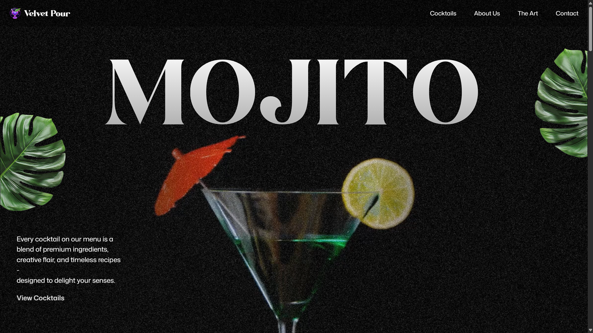
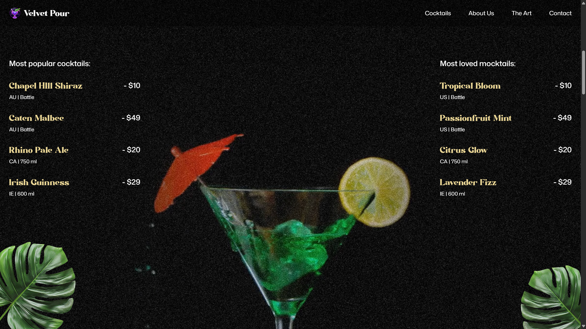
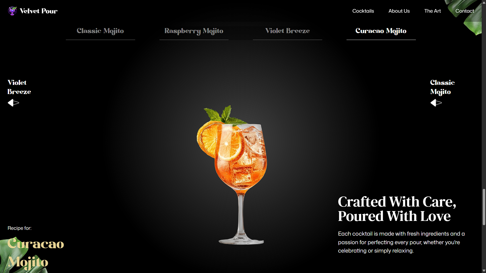
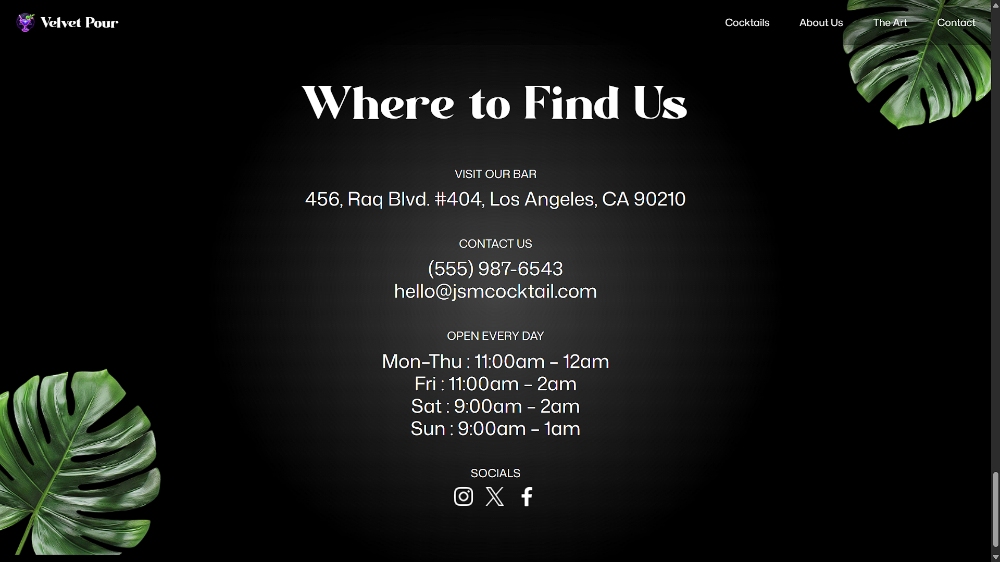

# VELVETPOUR LANDING PAGE

<div align="center">
  
</div>

<div align="center">
  
</div>

<div align="center">
  
</div>

<div align="center">
  
</div>

<div align="center">
  
</div>

<div align="center">
  
</div>

<div align="center">
  
</div>

## 🚀 Live Demo

<div align="center">
  <a href="https://velvetpourlandingpage.vercel.app/" target="_blank">
    
  </a>
</div>

## 📖 Overview

Velvet Pour is a premium cocktail landing page that showcases the art of mixology through stunning visuals and smooth animations. Built with modern web technologies, this project demonstrates advanced front-end development skills including React component architecture, Tailwind CSS styling, and professional GSAP animations.

The landing page features a sophisticated design with elegant typography, rich color schemes, and fluid animations that create an immersive user experience. Every element is crafted to reflect the luxury and craftsmanship associated with premium cocktail culture.

## ✨ Features

🎨 **Stunning Visual Design**
- Elegant, modern UI with premium aesthetics
- Carefully crafted color palette and typography
- High-quality imagery and visual elements

⚡ **Smooth GSAP Animations**
- Scroll-triggered animations for engaging user experience
- Fluid transitions and micro-interactions
- Performance-optimized animation sequences

📱 **Fully Responsive Design**
- Mobile-first design approach
- Seamless experience across all devices
- Adaptive layouts and components

🚀 **Modern Development Practices**
- Component-based React architecture
- Utility-first CSS with Tailwind
- Optimized performance and loading speeds

🎯 **Interactive Elements**
- Smooth scrolling navigation
- Hover effects and button animations
- Dynamic content presentation

## 🛠️ Tech Stack

<div align="center">

| Frontend | Styling | Animation | Build Tool | Deployment |
|----------|---------|-----------|------------|------------|
|  |  |  |  |  |

</div>

**Core Technologies:**
- **React 18+** - Component-based UI library
- **Vite** - Fast build tool and development server
- **Tailwind CSS** - Utility-first CSS framework
- **GSAP (GreenSock)** - Professional animation library
- **JavaScript ES6+** - Modern JavaScript features

**Development Tools:**
- **Vercel** - Deployment and hosting platform
- **npm/yarn** - Package management
- **Modern Browser APIs** - For enhanced functionality

## 🚀 Installation and Setup

### Prerequisites

Make sure you have the following installed on your system:
- **Node.js** (v18.0.0 or higher)
- **npm** or **yarn** package manager
- **Git** for version control

### Step-by-Step Installation

1. **Clone the Repository**
   ```bash
   git clone https://github.com/aridepai17/GSAP-ANIMATED-PAGES.git
   cd GSAP-ANIMATED-PAGES/cocktaillandingpage
   ```

2. **Install Dependencies**
   ```bash
   npm install
   # or if you prefer yarn
   yarn install
   ```

3. **Start Development Server**
   ```bash
   npm start
   # or
   yarn start
   ```

4. **Open in Browser**
   
   Navigate to `http://localhost:3000` to view the application.

### Build for Production

To create an optimized production build:

```bash
npm run build
# or
yarn build
```

The build folder will contain the optimized files ready for deployment.

## 📁 Project Structure

```
cocktaillandingpage/
├── public/
│   ├── vite.svg
│   ├── fonts/
│   │   └── Modern Negra Demo.ttf
│   ├── images/
│   │   ├── abt1.png
│   │   ├── abt2.png
│   │   ├── abt3.png
│   │   ├── abt4.png
│   │   ├── abt5.png
│   │   ├── arrow.png
│   │   ├── check.png
│   │   ├── cocktail-left-leaf.png
│   │   ├── cocktail-right-leaf.png
│   │   ├── cup-2.png
│   │   ├── drink1.png
│   │   ├── drink2.png
│   │   ├── drink3.png
│   │   ├── drink4.png
│   │   ├── fav.png
│   │   ├── fb.png
│   │   ├── footer-drinks.png
│   │   ├── footer-left-leaf.png
│   │   ├── footer-right-leaf.png
│   │   ├── hero-left-leaf.png
│   │   ├── hero-right-leaf.png
│   │   ├── insta.png
│   │   ├── left-arrow.png
│   │   ├── logo.png
│   │   ├── mask-img.png
│   │   ├── noise.png
│   │   ├── profile1.png
│   │   ├── profile2.png
│   │   ├── profile3.png
│   │   ├── profile4.png
│   │   ├── right-arrow.png
│   │   ├── slider-left-leaf.png
│   │   ├── slider-right-leaf.png
│   │   ├── under-img.jpg
│   │   └── x.png
│   └── videos/
│       ├── input.mp4
│       └── output.mp4
├── src/
│   ├── components/
│   │   ├── About.jsx
│   │   ├── Art.jsx
│   │   ├── Cocktails.jsx
│   │   ├── Contact.jsx
│   │   ├── Hero.jsx
│   │   ├── Menu.jsx
│   │   └── Navbar.jsx
│   ├── App.jsx
│   ├── index.css
│   └── main.jsx
├── constants/
│   └── index.js
├── finalimages/
│   ├── about us.png
│   ├── cocktails.png
│   ├── contact.png
│   ├── hero.png
│   ├── menu.png
│   ├── the art 1.png
│   └── the art 2.png
├── eslint.config.js
├── index.html
├── package.json
├── package-lock.json
├── README.md
└── vite.config.js
```

## 🤝 Contributing

Contributions are always welcome! Here's how you can contribute to this project:

### How to Contribute

1. **Fork the Repository**
   - Click the "Fork" button at the top right of this repository

2. **Clone Your Fork**
   ```bash
   git clone https://github.com/yourusername/GSAP-ANIMATED-PAGES.git
   cd GSAP-ANIMATED-PAGES/cocktaillandingpage
   ```

3. **Create a Feature Branch**
   ```bash
   git checkout -b feature/your-feature-name
   ```

4. **Make Your Changes**
   - Add your improvements or new features
   - Follow the existing code style and conventions

5. **Commit Your Changes**
   ```bash
   git add .
   git commit -m "Add: your descriptive commit message"
   ```

6. **Push to Your Fork**
   ```bash
   git push origin feature/your-feature-name
   ```

7. **Create a Pull Request**
   - Go to the original repository
   - Click "New Pull Request"
   - Describe your changes clearly

### Contribution Guidelines

- Follow React best practices and component patterns
- Maintain consistent code formatting
- Test your changes thoroughly
- Update documentation if needed
- Be respectful and constructive in discussions

## 👨‍💻 Author
- **GitHub:** [@aridepai17](https://github.com/aridepai17)

Feel free to reach out for collaborations, questions, or feedback!

## 📄 License

This project is licensed under the **MIT License** - see the [LICENSE](LICENSE) file for details.

## 🙏 Acknowledgments

Special thanks to the following resources and communities that made this project possible:

- **[GSAP (GreenSock)](https://greensock.com/)** - For the incredible animation library that brings the page to life
- **[Tailwind CSS](https://tailwindcss.com/)** - For the utility-first CSS framework that streamlined the styling process
- **[React](https://reactjs.org/)** - For the powerful component-based architecture
- **[Vercel](https://vercel.com/)** - For the seamless deployment and hosting platform
- **[JavaScript Mastery](https://github.com/adrianhajdin)** - For inspiring me to go forward with this absolute genius of a project.
---

<div align="center">
  <p>⭐ **Star this repository if you found it helpful!** ⭐</p>
  <p>🍸 **Crafted with passion for exceptional web experiences** 🍸</p>
  
  <a href="https://velvetpourlandingpage.vercel.app/" target="_blank">
    
  </a>
</div>
